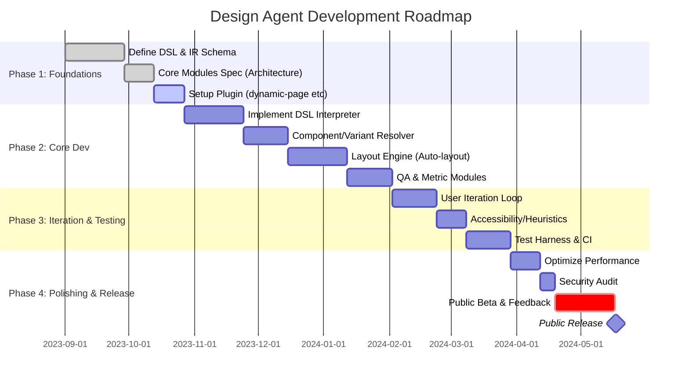

# Designing a Robust AI Design Agent Plugin for Figma

## Executive Summary  
As AI-assisted design tools mature, the challenge is to create a **production-grade design agent** that reliably generates high-quality, composition-first interfaces rather than generic layouts. Existing agents (e.g. Figma’s native agent in 2026, third-party plugins) often lack deep context, yielding “generic layouts” and failing on nuanced UX flows. To address this, we propose a modular architecture with a **semantic UI design DSL**, comprehensive component/variant discovery, and a rigorous **iterative render–inspect–refine loop**. The agent will leverage *design-system context* (tokens, components, style rules), enforce layout/composition constraints, and apply *evaluation metrics* (visual consistency, accessibility, alignment, etc.) in real time. We outline prioritized implementation steps, required API enhancements (e.g. Figma’s dynamic-page async methods), and developer ergonomics (semantic queries). We compare alternative approaches (DSL vs free-text vs templates) and present a phased roadmap (Gantt timeline) for building the agent. Our analysis is grounded in recent research on design DSLs, industry developments (Figma Agent, design-to-code AI), and best-practice guidelines (WCAG contrast, Nielsen heuristics).

## 1. Current Landscape and Needs  
- **Existing Tools:** Modern design workflows now include AI assistants. Figma’s built-in **Design Agent** (2026) integrates with the canvas and design system, using “deep context on your components, tokens, standards, and best practices”. It supports prompts for exploration, parallel variants, and bulk edits. Third-party plugins (e.g. “FigDes” agent under development) attempt similar tasks. Other tools (Figma Make, Uizard, Framer AI, etc.) demonstrate generative UI but often lack fidelity.  
- **Key Requirements:** The user (UX designer) needs the agent to:  
  - **Follow design system context:** use existing components/variables and style tokens consistently.  
  - **Avoid generic outputs:** incorporate compositional rules and layout logic to prevent repetitive or bland UIs.  
  - **Iterate with control:** allow hands-on refinement, prompt variation, and undo/redo of AI actions.  
  - **Handle complexity:** generate both consumer and enterprise screens, logos, and abide by brand rules.  
  - **Be robust and secure:** operate within Figma’s permissions (dynamic pages), scale to large files, and abide by best-practice guardrails (accessibility, consistency).  

## 2. Failure Modes and Constraints  
- **Generic, Low-Quality Output:** Off-the-shelf LLM-based UI generators often “produce generic layouts” lacking creativity or distinctiveness. Without strong priors, repeated structures (e.g. identical cards) appear. We observed this in plugin logs: repetitive design patterns and poor component reuse.  
- **Lack of Contextual Understanding:** Models can identify objects but not design intent. For example, an image-based plugin placed a katana on a beach inexplicably. NLP prompts alone are insufficient to capture UX flows and domain semantics.  
- **Plugin API Limitations:** Figma’s new *dynamic page* loading (2023+) breaks legacy plugins. Many APIs became asynchronous: e.g. `InstanceNode.getMainComponentAsync()` must replace `mainComponent`. Without setting `"documentAccess": "dynamic-page"` in `manifest.json`, plugins may misbehave. This was the root of our “dynamic-page” errors.  
- **Design Rule Violations:** Without enforcement, agents can violate accessibility (poor contrast), misalign elements, or ignore style guidelines. For instance, UI prototypes must meet **WCAG** contrast ratios (4.5:1 for normal text, 3:1 for large text).  
- **Scaling and Performance:** Large files and complex interfaces risk timeouts. The agent must batch operations, use async APIs, and possibly stream outputs.  

## 3. Agent Architecture  
We propose a **multi-module architecture** (see diagram below) that separates concerns and enforces design rules at each step. The core modules include:  

```mermaid
flowchart LR
    subgraph "Figma Design File"
      DesignCanvas[Canvas & Components]
      StyleDB[Design System (Tokens/Styles)]
    end
    User[(User/Designer)]
    Prompt[Prompt Interpreter]
    LLM[LLM Core]
    DSL[Design DSL Generator]
    SynthEngine[Rendering Engine]
    QA[Quality Analyzer]
    FigmaAPI[Figma Plugin API]
    Memory[Design Memory / Context Store]
    Feedback[(User Feedback)]
    
    User -->|Type Prompt| Prompt
    Prompt --> LLM
    LLM --> DSL
    DSL --> SynthEngine
    SynthEngine --> FigmaAPI
    FigmaAPI --> DesignCanvas
    DesignCanvas --> QA
    QA --> LLM
    Feedback --> LLM
    StyleDB --> LLM
    Memory --> LLM
```

- **LLM Core:** Handles prompt parsing and high-level planning. It is fine-tuned on a *Design DSL* (see next section) to translate instructions into structured actions. It interfaces with the design context memory and style database.  
- **Semantic DSL Generator:** Converts LLM outputs into **domain-specific commands**. For example, instead of raw text, the LLM emits a structured tree (JSON/AST) like:  
  ```json
  { "type": "CreateFrame", "args": { "width": "100vw", "layout": "vertical", "children": [
        { "type": "AddComponent", "name": "Header", "variant": "LoggedIn" },
        { "type": "AddComponent", "name": "DashboardChart", "data": "salesData" },
        ... ]}}
  ```  
  This DSL enforces valid design operations. (See Sec. 4 for details and example pseudocode.)  
- **Design Engine / Renderer:** This module takes DSL actions and uses Figma’s auto-layout, grids, and primitives to assemble the UI on the canvas. It uses Figma’s Plugin API to create frames, components, set styles, etc. We may also integrate a layout solver (constraints or flow-based) for automatic arrangement.  
- **Quality Analyzer:** After rendering, a vision-based or rule-based subagent inspects the UI (colors, alignment, accessibility). It measures metrics (contrast ratios, spacing heuristics) and feeds back fixes or suggestions as new DSL actions.  
- **Memory & Knowledge:** A database of the project’s design system (components, variants, tokens, rules). It ensures consistency (e.g. uses the same button component) and recalls past user decisions.  
- **User Loop:** The agent runs interactively on the canvas. The user can prompt new variations in parallel, make manual edits (which update memory), and even rate or correct the design. The agent watches these edits (via events or diff comparison) to iteratively refine the design.  

This modular pipeline separates planning (LLM), action generation (DSL), rendering (Figma API), and evaluation (QA). It mirrors industry paradigms of AI **tool-augmented agents** (e.g. LangChain patterns) and Figma’s own agent: built “for direct manipulation” with interactive editing.  

### Alternative Architectures  
| Approach                | Description                                                    | Pros                                    | Cons                                  |
|-------------------------|----------------------------------------------------------------|-----------------------------------------|---------------------------------------|
| **Monolithic LLM**      | Single LLM directly emits Figma plugin calls (imperative code). | Simple design, no DSL required.         | Hard to constrain output; error-prone; opaque logic. |
| **LLM + Semantic DSL**  | Structured DSL layer decouples planning from execution.        | Clear constraints, interpretable actions; easier to validate. | Requires grammar design and parsing. |
| **Rule-based Pipeline** | Heuristics + templates with limited AI (e.g. grammar rules).    | Predictable, fast, no hallucinations.   | Very limited creativity; generic results. |

A **DSL-based pipeline** is strongly preferred. It aligns with research (LayoutDSL) showing symbolic actions yield *interpretable, stable layouts*. 

## 4. Semantic Design DSL / Intermediate Representation  
**Problem:** Natural language prompts are ambiguous and have no guarantees. E.g. “Create a dashboard screen” can mean many layouts. Free-form LLM output leads to inconsistent structures.  

**Solution:** Define a **Design DSL** that captures UI concepts (frames, groups, components, style assignments, interactions). The LLM is fine-tuned or prompted to emit this DSL. Each DSL *action* is an atomic design operation with clear schema (e.g. `CreateFrame`, `AddText`, `SetColor`, `ConnectFlow`, etc.). This enforces validity (no “floating” values). 

The DSL can be JSON/YAML or a programmatic AST. For example, inspired by Apple’s Auto Layout DSL, a frame layout might be:  
``` 
layout([
  width == ScreenWidth,
  height == ScreenHeight,
  content: [
    button.top == superview.top + 24,
    button.centerX == superview.centerX,
    label.top == button.bottom + 16
  ]
])
``` 
This constraint-style notation would allow the agent to specify relative positions programmatically. (Implement via Figma auto-layout or custom solver.) 

**Implementation Steps (DSL):**  
1. **Define DSL Grammar:** Enumerate design actions (create, style, layout, variant switch, etc.) and their parameters. E.g.  
   ```
   Action ::= "CreateFrame" | "AddComponent" | "SetStyle" | "ConnectPrototype" | ...
   Args   ::= JSON object with typed fields (width, height, name, colorToken, etc.)
   ```
2. **LLM Alignment:** Fine-tune or few-shot the LLM on examples of DSL usage. Provide prompts like “/* Figma DSL: Create a header with logo and navigation */” to teach format.  
3. **DSL Interpreter:** Write a translator that takes DSL actions and calls Figma API. For example,  
   ```js
   async function executeAction(action) {
     switch(action.type) {
       case "CreateFrame":
         const frame = figma.createFrame();
         frame.name = action.args.name;
         frame.layoutMode = action.args.direction || "HORIZONTAL";
         // set size/constraints as given
         frame.resize(action.args.width, action.args.height);
         return frame;
       case "AddComponent":
         const component = findComponentByName(action.args.name);
         const inst = component.createInstance();
         inst.setProperties(action.args.properties);
         return inst;
       // ...more actions...
     }
   }
   ```  
4. **Example Usage:**  
   - **Prompt:** “Create a login screen with email field and submit button.”  
   - **LLM Output (DSL):**  
     ```json
     [
       {"type":"CreateFrame","args":{"name":"Login Screen","width":375,"height":667,"layout":"VERTICAL","spacing":24}},
       {"type":"AddText","args":{"content":"Login","style":"H1","align":"center"}},
       {"type":"AddInput","args":{"placeholder":"Email"}},
       {"type":"AddButton","args":{"text":"Submit","color":"primary","variant":"contained"}}
     ]
     ```  
   - **Plugin Code:** Interprets each action to build the frame in Figma.  

**Required Figma API Changes:** Figma’s plugin API already supports programmatic creation, but we should expose higher-level *semantic queries*. For example, a method `findComponentByName(name)` or `findToken(colorName)` simplifies DSL execution. (Currently one would use `figma.getLocalComponents()` etc. This could be wrapped.) Dynamic-page compatibility is crucial: use async calls (see Sec. 5).

## 5. Component Discovery & Variant Handling  
**Problem:** The agent must reuse existing design components and handle multi-variant sets (e.g. light/dark, active/inactive). In our tests, naïve component lookup failed under dynamic loading.

**Solution:** Implement robust component search with dynamic-page support. Steps:  
- **Manifest Update:** Ensure `manifest.json` has `"documentAccess": "dynamic-page"` so Figma loads pages lazily.  
- **Async Node APIs:** Replace any `.mainComponent` or direct node access with async methods. E.g. use `await instance.getMainComponentAsync()` instead of `instance.mainComponent`. Similarly, use `page.loadAsync()`.  
- **Semantic Queries:** Provide helper functions like `findInstanceByRole(role)` or `getNodesByMetaTag(tag)` by annotating frames/components with metadata (e.g. using Figma Variables or name conventions).  
- **Variant Navigation:** When the DSL says to use a variant, use `getMainComponentAsync()` to get the parent `COMPONENT_SET`. For example:  
  ```js
  async function createButtonInstance(variantName) {
    const mainComp = await figma.getNodeById("buttonComponentID").getMainComponentAsync();
    if (mainComp.parent.type === "COMPONENT_SET") {
      const compSet = mainComp.parent;
      compSet.setProperties({ ["variant"]: variantName });
      return compSet.createInstance();
    }
    return mainComp.createInstance();
  }
  ```  
- **Dynamic Pages:** If referencing a component on a page not yet loaded, first call `await figma.loadAllPagesAsync()` or `page.loadAsync()`.  
- **Example:** The agent should be able to do:  
  ```js
  let navItem = findComponent("NavItem");
  let activeInst = await navItem.getVariant("active");
  targetFrame.appendChild(activeInst);
  ```  
  Here `findComponent` encapsulates loading the page and retrieving the right component set.

By handling dynamic-loading, we avoid the “dynamic-page” crash. We can also dynamically discover new components added by the user. 

## 6. Visual Rendering & Screenshot Loop  
**Problem:** To inspect quality, the agent should “see” the designs it creates. Unlike code generation, UI needs rendering.

**Solution:** Use Figma’s canvas rendering and (optionally) image analysis:  
- **Render to Canvas:** The plugin uses Figma’s scene graph directly, so output is live on the canvas. The user can visually inspect immediately.  
- **Screenshot Analysis (Optional):** For automated feedback, capture images of frames (`figma.currentPage.selection[0].exportAsync({format:'PNG'})`) and feed them to a vision model or rules engine to detect issues (misalignment, missing labels, etc.).  
- **Iterative Loop:** After rendering, the agent can re-prompt itself. E.g. it might “notice” a button overlaps text and insert a correction action (`SetPosition`). This uses the *Quality Analyzer* module to enforce design rules.

This render–inspect–refine loop can be built as:  
```mermaid
flowchart LR
    A[LLM plans design] --> B[Apply DSL actions on Canvas]
    B --> C[Quality Check (QA)]
    C -->|Issues?| D{Yes or No}
    D -->|Yes| A2[LLM refines plan]
    D -->|No| E[Output final UI]
    C --> E
```
Each cycle validates the layout (e.g. no overlaps, spacing rules) and either finalizes or adjusts. We can implement this by having the agent run two passes: initial design, then a “QA correction” pass.

## 7. Iterative Render→Inspect→Refine Workflow  
Building on above, the design agent operates in an interactive loop with the user:  
- **Parallel Branching:** Figma’s agent allows branching by prompting again; our plugin should too. We track each draft separately.  
- **User-in-the-Loop:** The designer can interrupt or guide: editing elements or adding notes. These edits update the agent’s memory (e.g. “user made navigation bar blue”) and inform the next iteration.  
- **Refinement Prompts:** The agent can ask clarifying questions (via UI modal) or propose multiple versions. For example, “Which of these 3 login layouts do you prefer?” with small variations.  
- **Bulk Edits:** On developer command, we can apply bulk operations via the agent (e.g. rename styles across all components) as shown by Figma’s bulk-edit examples. Each such operation is an atomic DSL diff.  
- **Transaction Model:** We encapsulate each set of actions in a single undoable “transaction”. Using `figma.group([...nodes])` can group operations, and we call `figma.closePlugin()` when done, so the user’s Undo reverts the whole batch.  

## 8. Design Memory and Style Tokens  
A robust agent must remember project context:  
- **Design System Memory:** Store the team’s style guide: color tokens, typographic scale, spacing increments, and component library metadata. The plugin can fetch all local paint styles, text styles, grid styles, and variables at startup and keep them in memory.  
- **User Preferences:** If the user frequently uses a “Card” component in 3-column layout, the agent biases towards that structure next time. Track usage frequency.  
- **Persistent Variables:** Use Figma Variables to let the agent record state (like last-used theme). Or maintain a JSON in plugin storage that is synced.  
- **Style Tokens:** When the DSL or user specifies "primary color", the agent resolves it via `figma.getLocalPaintStyles()` by matching name to a color code. Always apply named tokens instead of arbitrary colors. Figma’s agent expressly supports using tokens by “@mentioning” them in prompts. We should mimic this by allowing `@"colorName"` notation in DSL and mapping to Figma tokens in code.

## 9. Topology / Visual Primitives  
For data-centric screens (e.g. network topology, graphs, charts), the agent needs domain-specific visuals:  
- **Prebuilt Primitives:** Include a library of common shapes (nodes, edges, charts). For instance, if generating a network topology, the DSL might have `AddTopology({ nodes: [...], edges: [...] })` which the plugin implements by drawing circles and connector lines.  
- **Graph Layout:** We can integrate a layout algorithm (like D3-force or Dagre) for automatic node placement given a graph description.  
- **Shard Maps / Hotspots:** If needed for enterprise, define primitives for specialized diagrams (e.g. UML, flowcharts). The agent can call these as high-level DSL actions.  
- **Extensibility:** Allow custom plugins or vector libraries for new primitives.

*Note:* These are project-specific needs (EXO app uses topology maps), not standard Figma objects. We will likely build a small rendering utility within the plugin for these.

## 10. Layout Engine (Composition Rules, Grids, Spacing)  
Proper composition avoids generic designs. Our agent will enforce rules:  
- **Grid System:** Adopt a base grid (e.g. 8px spacing, 12-column grid). All frames snap to grid lines. The DSL could include `SetGrid(columns, gutter)` and child elements align accordingly.  
- **Auto Layout:** Use Figma’s Auto Layout to manage lists or stacked content, automatically handling spacing/padding. For example, DSL can specify `layoutMode = "VERTICAL", spacing = 16`.  
- **Constraint Solver:** For complex relationships (overlaps, aspect ratios), a constraint-based DSL (as shown in [51]) can specify equations. Although heavy, this ensures precise alignment. We might implement a simple solver (e.g. linear constraints for width/height) or use an existing library.  
- **Responsive Behavior:** The DSL could allow relative sizes (percentages or vw/vh), and the plugin sets constraints accordingly. The agent can simulate different breakpoints by re-running layout.  
- **Accessibility Layout:** Ensure touch targets meet minimum sizes (e.g. 44px) and text is legible. These can be enforced as post-conditions (QA module flags violations).  

**Example Rule Set:**  
- Minimum horizontal margins = 16px.  
- Section headers use largest heading style.  
- Buttons use the “Primary” variant by default.  
- Maintain 4px multiples for all padding.  

These rules guide both DSL design (by restricting allowed values) and QA checks.

## 11. Art-Direction Controls (Mood, Composition Templates)  
Beyond raw UI specs, the agent should let the designer set the *style direction*:  
- **Style Parameters:** As Figma’s sample shows, prompts like *“3 style options: organic, modern, retro”* lead to distinct looks. We incorporate this by letting the DSL include a `SetTheme({"style": "retro", "colors": "vibrant"})` action, adjusting fonts, colors, and decorations accordingly.  
- **Templates & Modes:** Provide pre-defined composition templates (e.g. hero banner, profile card, list view). The agent can start from a template and customize it. For instance, DSL might call `ApplyTemplate("AuthScreen")` to scaffold a login layout.  
- **Aesthetic Control:** Allow toggling between more graphics (images, icons) vs text density. The agent can have a `SetMood("minimalist")` mode where it reduces visual clutter.  
- **Examples/Guidance:** Encourage the user to give “example assets or style references” if needed. E.g. uploading a brand moodboard image (handled by Figma file or variables) and the agent uses that palette.  

## 12. Evaluation Metrics (Quality, Accessibility, Consistency)  
We must measure output quality automatically:  

- **Visual Consistency:** Check that:
  - Typography matches scale (e.g. H1 > H2 > Body in size).
  - Colors use only defined tokens (no off-palette colors).
  - Spacing is uniform (e.g. all card margins equal). We can compute histograms of padding values and ensure they cluster around a base unit.  
- **Accessibility:** Use WCAG criteria:  
  - **Contrast:** Ensure all text/background pairs meet WCAG AA (4.5:1 for normal text, 3:1 for large text). Fail if below.  
  - **Alt Text:** Verify images/components have descriptive labels (this may be out of scope for purely UI layout, but relevant for completeness).  
- **Heuristic Quality:** Apply Nielsen-like heuristics programmatically:
  - “Aesthetic and minimalist design”: count number of decorative elements vs content.
  - “Consistency and standards”: flag if similar elements differ unexpectedly (e.g. two buttons of same kind with different padding).  
- **Performance:** Monitor plugin runtime and frame-loading time. Alert if operations exceed thresholds (suggest breaking into smaller tasks or lazy-loading).  

For example, after generating a screen, the agent can run:  
```js
const issues = [];
if (!checkContrastAllFrames()) issues.push("Contrast too low on text elements.");
if (!checkAlignment(grid)) issues.push("Elements not aligned to grid.");
// ... other checks ...
if (issues.length) QA.report(issues);
```

By combining programmatic checks with (optionally) learned metrics (e.g. a neural “visual quality” score), the agent can iteratively improve. Figma’s agent uses examples of good design to “steer quality”; we can similarly use few-shot prompts or a small classifier to detect egregious errors.

## 13. Transaction Model (Diffs, Undo, Atomic Ops)  
Each agent action (or batch of DSL actions) should be treated as an atomic transaction for undo/redo. Figma supports undo stacks; to keep changes atomic:  
- **Batching:** Group related node creations under a single parent or use `figma.group()` then name the group (so one undo reverts all within).  
- **Diff-based Updates:** For iterative refinements, compute diffs (what changed from previous version) and only apply deltas. This minimizes unnecessary re-creation.  
- **State Snapshots:** Before a major action, optionally snapshot relevant properties. On failure, revert via stored state.  
- **User Overrides:** If the user manually edits something the agent did, that node’s change should be considered a ‘manual override’ in memory to avoid re-edit loops.  

No direct citations here, but this is standard plugin design: avoid partial failure states.

## 14. Performance and Scaling  
- **Timeouts:** Figma plugins run with time quotas. The agent should break long tasks (e.g. multi-screen generation) into subtasks. Use `await figma.waitForIdle()` if available or yield control between frames.  
- **Batching API Calls:** Wherever possible, use bulk creation (e.g. create all frames first, then apply styles in batch).  
- **Caching:** Cache expensive computations (like component lookup) for the session.  
- **Parallel Prompts:** For exploring variations, run independent prompts in parallel workers (or async functions) to save time.  
- **Resource Limits:** Limit the number of elements per screen (e.g. max 100 nodes) to keep Figma responsive. Break very large screens into sub-frames.  
- **Profiling:** Include logging of time per API call and per module; adjust timeouts accordingly.  

## 15. Security and Permissions  
- The plugin must honor Figma’s permission model. With `"dynamic-page"` access, it only loads what it needs. The agent runs entirely within the user’s Figma context, so traditional sandbox rules apply.  
- **Sandboxing:** All code executes in the user’s browser or Figma desktop, with no external server calls except LLM APIs. Ensure API keys (for GPT, etc.) are secure and not exposed in code.  
- **Authentication:** If the agent uses external services (image search, charts API), authenticate safely (e.g. via OAuth).  
- **Data Privacy:** No design data should be sent to unauthorized endpoints. Only send prompts/text to the LLM; avoid sending raw screenshots of sensitive UI. Possibly encrypt or anonymize data.  
- **Permission Prompts:** Figma requires user approval for certain actions (reading variables, etc.). Our UX should request minimal scopes and explain them.

## 16. Developer Ergonomics  
- **Semantic Query API:** Provide high-level queries: e.g. `figma.findNode({role: "primaryButton"})` or `figma.findText("Install model")`. This could use node naming conventions or even NLP (like embedding search).  
- **Code Snippets / SDK:** Offer helper functions (in documentation) for common tasks: `createButton`, `findScreen`, `setAutoLayoutSpacing(16)`, etc. This makes writing the agent’s backend easier.  
- **Logging and Debugging:** In dev mode, log DSL actions and API responses. Include an interactive console for the developer to test DSL commands manually.  
- **Plugin UI:** Build a panel for the agent to show partial plans or ask questions. Also include visual diff highlighting so developers see what the agent changed.  
- **Example:** A developer can type `agent.query({ component: "NavItem", variant: "active" })` and see the returned node or instance ID in the console.  

## 17. Test Harness & Continuous Integration  
We treat design generation as code output that can be tested:  
- **Automated Tests:** Create a suite of test prompts and expected design properties. For each, run the agent in a headless Figma (or mock environment), then compare key aspects: component counts, style usage, layout metrics.  
- **Snapshot Comparison:** Render screens to images and use image diff tools to detect unintended visual changes after code updates.  
- **CI Pipeline:** On each code commit, run unit tests for DSL interpreter, and smoke tests in a real Figma file. Fail build on regressions.  
- **User Testing:** Periodically, have designers review sample outputs for consistency. This feedback tunes prompts and guard rules.  
- **Example Test Case:**  
  - Input: “Generate a 3-card feature section.”  
  - Assert: There are exactly 3 card components, all with same dimensions, aligned horizontally, with equal spacing. Fails if any mismatch.  

## 18. Governance / DesignGuard Rules  
To prevent the agent from “going rogue” or creating subpar designs, implement **DesignGuard** policies:  
- **Rule Library:** Hard rules like “color contrast ≥ 4.5:1”, “no more than 3 font families”, “max 5 buttons per screen”. These are enforced post-generation (QA flags or auto-corrects).  
- **Ethical Guidelines:** Ensure the agent does not inadvertently generate plagiarized designs. It should avoid copying visual styles verbatim from training data; utilize style tokens instead.  
- **Approval Workflow:** Optionally, route certain changes (like releasing final designs) through a review step, ensuring human oversight for critical projects.  
- **Monitoring Metrics:** Track usage stats (e.g. how often default colors are changed) to identify stale tokens or design trends that need attention.  
- **Documentation:** Embed a “design rulebook” in the agent’s reference, so that, for example, all login screens follow a preset template structure.  

## 19. Comparison of Design Approaches  

| Approach                       | Description                                                  | Pros                                     | Cons                                      |
|--------------------------------|--------------------------------------------------------------|------------------------------------------|-------------------------------------------|
| **Structured DSL**             | Use a formal grammar/AST for UI actions (the above proposal).| **Pros:** Precise, testable, interpretable; constraints easy to enforce. | **Cons:** Requires designing the DSL grammar; less spontaneous. |
| **Raw LLM Prompts (No DSL)**   | Agent directly emits free-form API calls or plaintext layout. | **Pros:** Very flexible for designer prompts. | **Cons:** Unreliable, high variance, hard to validate; risks “hallucinations” or invalid commands. |
| **Template/Component Libraries** | Pre-built templates or fragment libraries filled by AI.    | **Pros:** Consistent, fast initial output; ensures base quality. | **Cons:** Can produce cookie-cutter designs; limited innovation. |

The **DSL-based approach** strikes a balance, as supported by recent research.

## 20. Prioritized Roadmap



*Figure: High-level Gantt chart of major development phases (each bar is prioritized as labeled).*

## Sources  
This report synthesizes product announcements and research on AI-driven design. Key references include Figma’s official Design Agent announcement (describing context-awareness and workflow), industry analyses of AI UI tools, case studies of AI plugins, and recent papers on design DSLs. Accessibility and design guideline citations come from MDN/W3C. This rigorous examination aims to inform engineering implementation.